# School_District_Analysis
## This GitHub repository is created to assist Maria's team for school district analysis utilizing Anaconda, Jupyter Notebook and Python tools.  
### Originally this report was supposed to be a high-level snapshot of the districts in Py City Schools focusing on the following key metrics.
- Total number of students
- Total number of schools
- Total budget
- Average math score
- Average reading score
- Percentage of students who passed math
- Percentage of students who passed reading
- Overall passing percentage
### However, feedback from the board and Maria's supervisor expanded the report to include multiple dataframes which included high and low performing schools, average math and reading scores by grade, scores by school spending per student, scoring data by school size and type.  This analysis was completed in the PyCitySchools file, [PyCitySchools.ipynb](PyCitySchools.ipynb).  In an unexpected turn of events, The school board notified Maria and her supervisor that the students_complete.csv file shows evidence of academic dishonesty; specifically, reading and math grades for Thomas High School ninth graders appear to have been altered.  

### Therefore, the report deliverable has pivoted to a data scrub of the Thomas High School 9th grade data and a revised version of this report.  The deliverables pictured below will show display some of the code and visuals necessary to complete said analysis.
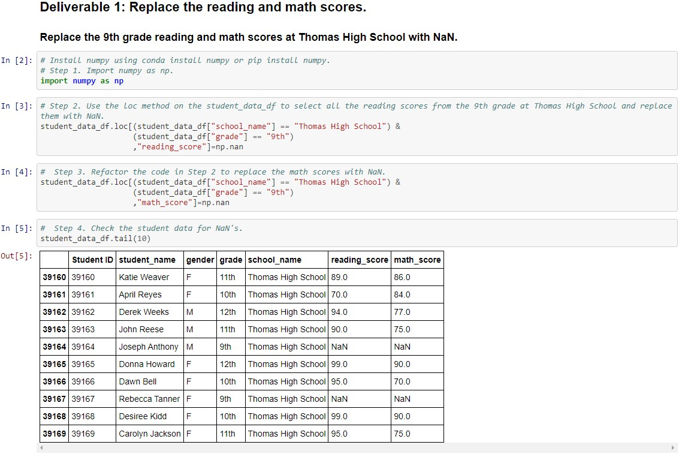
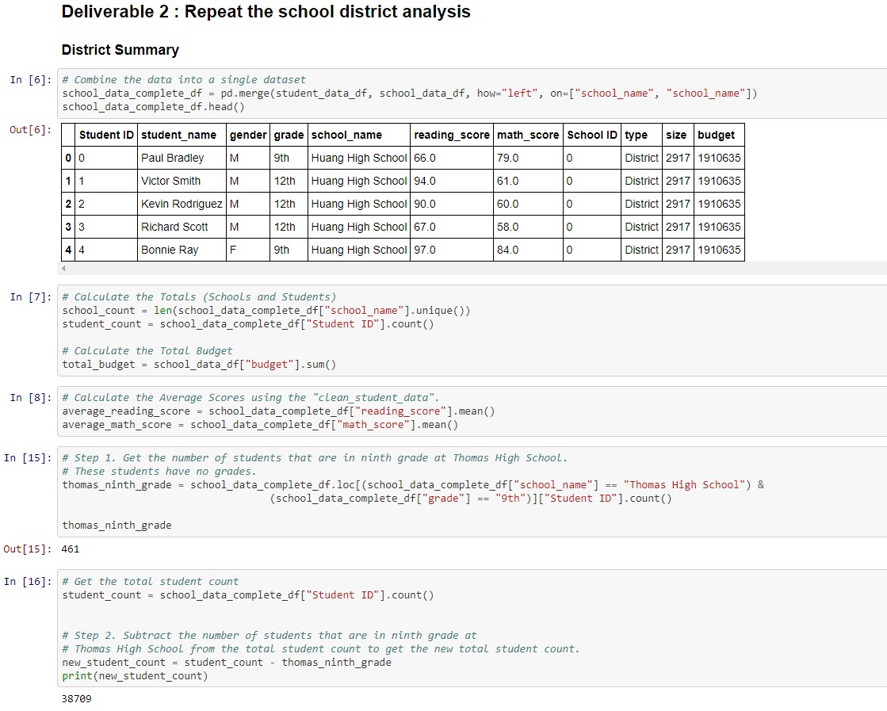
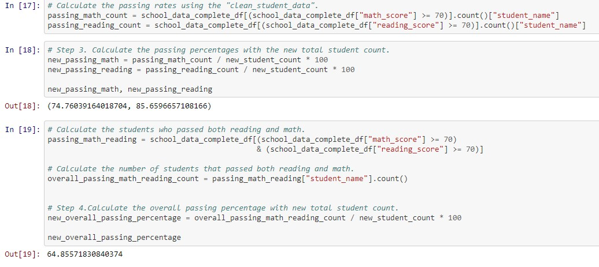
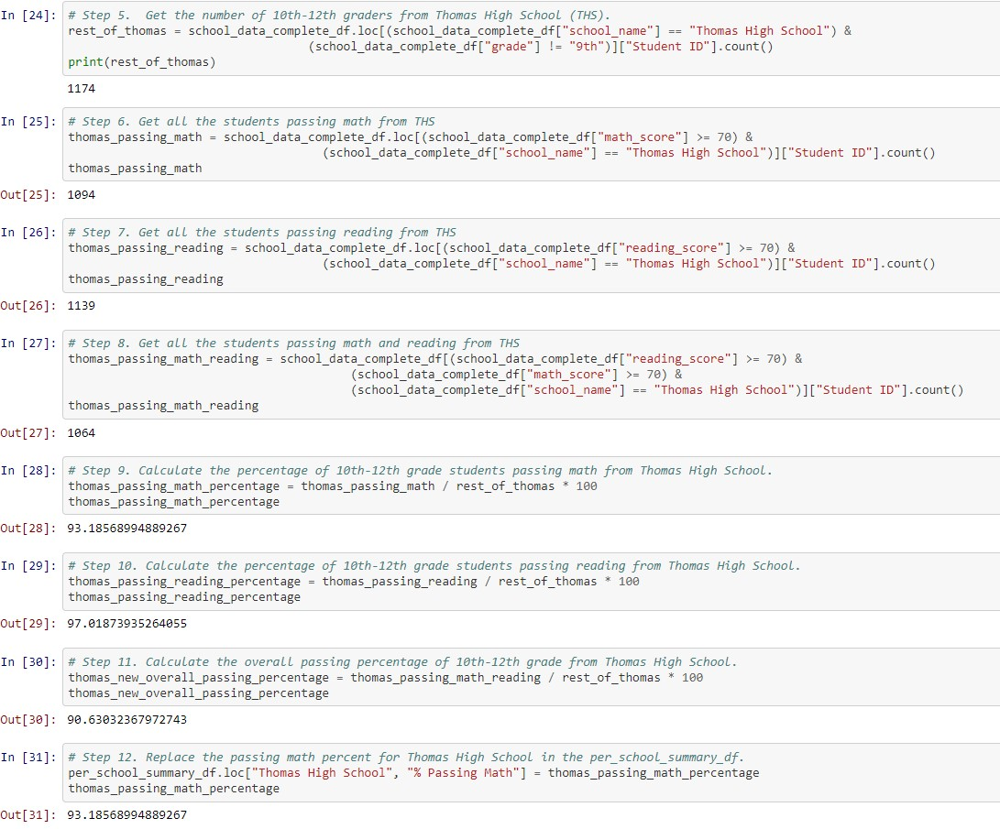
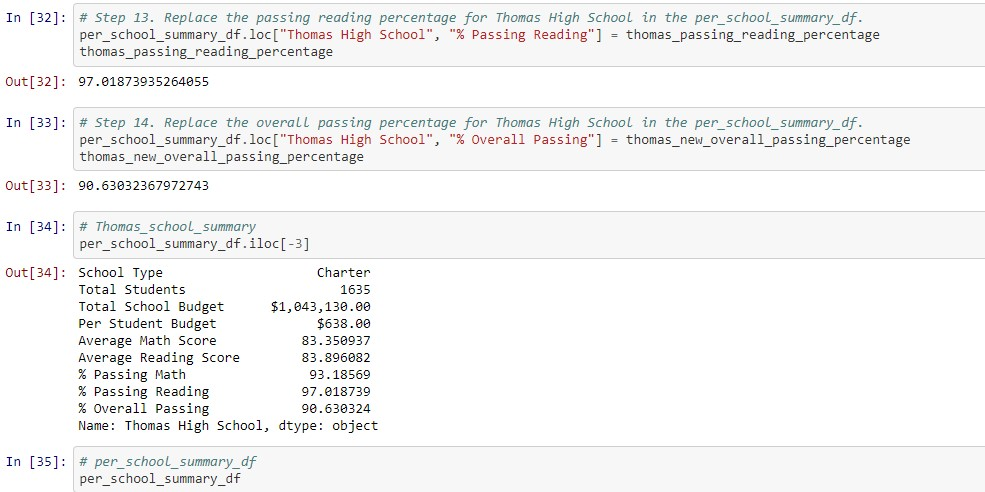
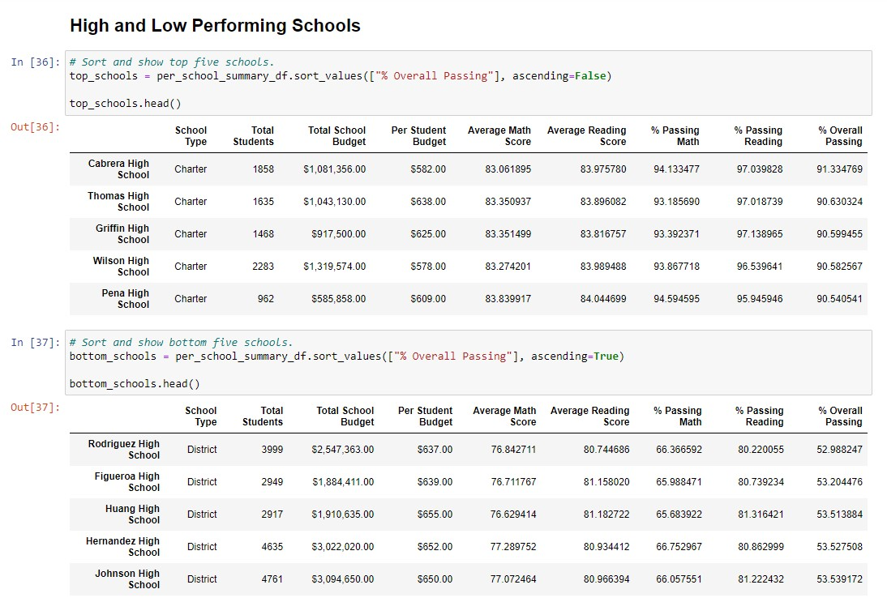
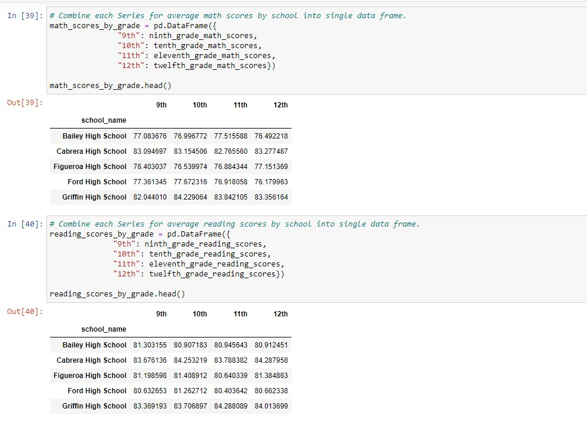
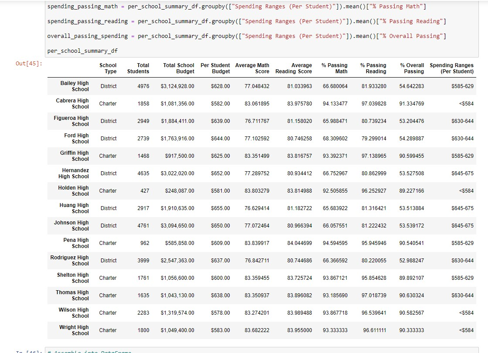
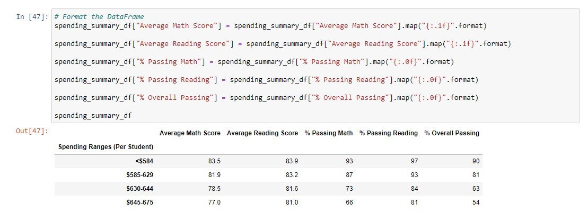
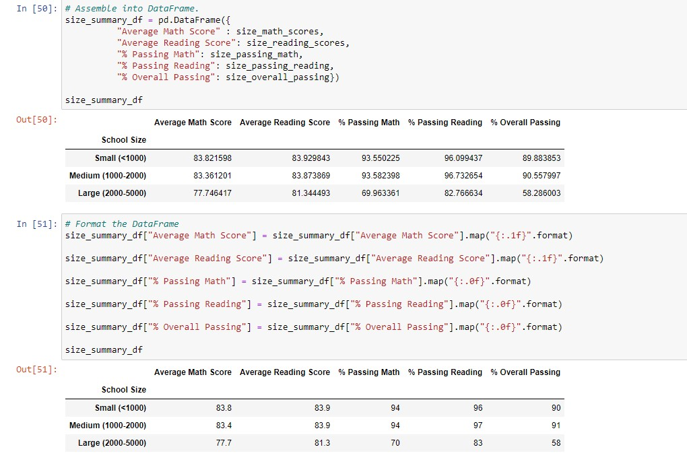
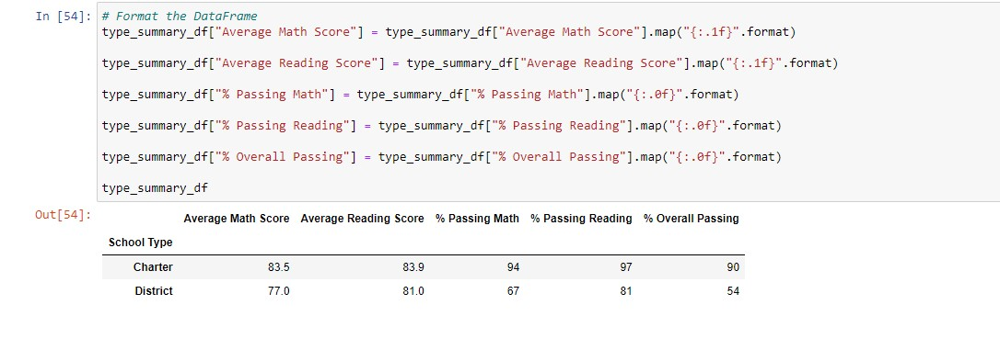
