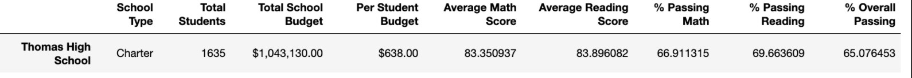

# School_District_Analysis
## This GitHub repository is created to assist Maria's team for school district analysis utilizing Anaconda, Jupyter Notebook and Python tools.  
### Originally this report was supposed to be a high-level snapshot of the districts in Py City Schools focusing on the following key metrics.
- Total number of students
- Total number of schools
- Total budget
- Average math score
- Average reading score
- Percentage of students who passed math
- Percentage of students who passed reading
- Overall passing percentage
### However, feedback from the board and Maria's supervisor expanded the report to include multiple dataframes which included high and low performing schools, average math and reading scores by grade, scores by school spending per student, scoring data by school size and type.  This analysis was completed in the PyCitySchools file, [PyCitySchools.ipynb](PyCitySchools.ipynb).  In an unexpected turn of events, The school board notified Maria and her supervisor that the students_complete.csv file shows evidence of academic dishonesty; specifically, reading and math grades for Thomas High School ninth graders appear to have been altered.  

### Therefore, the report deliverable has pivoted to a data scrub of the Thomas High School 9th grade data and a revised version of this report.  The deliverables pictured below will show display some of the code and visuals necessary to complete said analysis.

### For Deliverable 2, this report focused on the functional removing of the Thomas High School 9th grade data and the subsequent effects this data change - please see code and visualizations below.

### Please reference last 2 visualizations above.  Note the change for Thomas High School data was due to the NaN insertions for the 9th graders on the visualization directly above.  The Thomas High School data for the 10th - 12th graders on a step by step basis from the code and calculations show they performed at a high level for % Passing Math, % Passing Reading, and subsequentally a high overall passing grade was achieved at 90.6%.

### This is an interesting graphic for high and low performing schools - Note that all of the low performing schools come from Districts and all of the high performing schools come from Charter schools.  I will dig a litter deeper into this later.

### There is no discernable performance difference within each school’s grade classes.

### The two charts above regarding school spending are fascinating.  The data on face level shows that there is a strong correlation in school spending being a detriment to student performance.  This is lazy analysis, of course because there are a few factors at play here.
1.	Be mindful of the charter school v. district school performance disparity as noted in previous graphics.
2.	Also note the district schools tend to be much larger, and thus teaching resources are spread much thinner and class sizes are much larger in these district schools.
3.	Notice that the charter school funding is less, but almost on par with district school funds per student.  This is somewhat puzzling since charter schools have private funding arms which are potentially substantial.

### The differences are staggering between the performance of larger v. smaller school sizes and more specifically - district v. charter school types.  These last 2 graphics above show a massive disparity in student performance in these different learning environments.  This last graphic shows a 60% delta in performance between district v. charter schools.  
## Conclusions
### The net effect of the omission of the Thomas High School 9th graders is almost negligible. Why? Thomas High School appears to be a high performing charter school in a historical sense since their 10th - 12th graders performed excellently when compared to their peer classes.  Hence, the high-level findings of the original report do not differ much at all from this updated report.  If one thinks about this logically, it makes sense.  We are essentially throwing out 461 data points in a data set of over 39000 data points - this is extremely negligible on a percentage basis (approximately 1.18% difference, to be exact).  The Py City School district needs to do a more granular approach on why charter schools are vastly outperforming district schools and either implement some charter school tactics, and or investigate re-allocating funds used for charter schools since they have private funds available to them.
